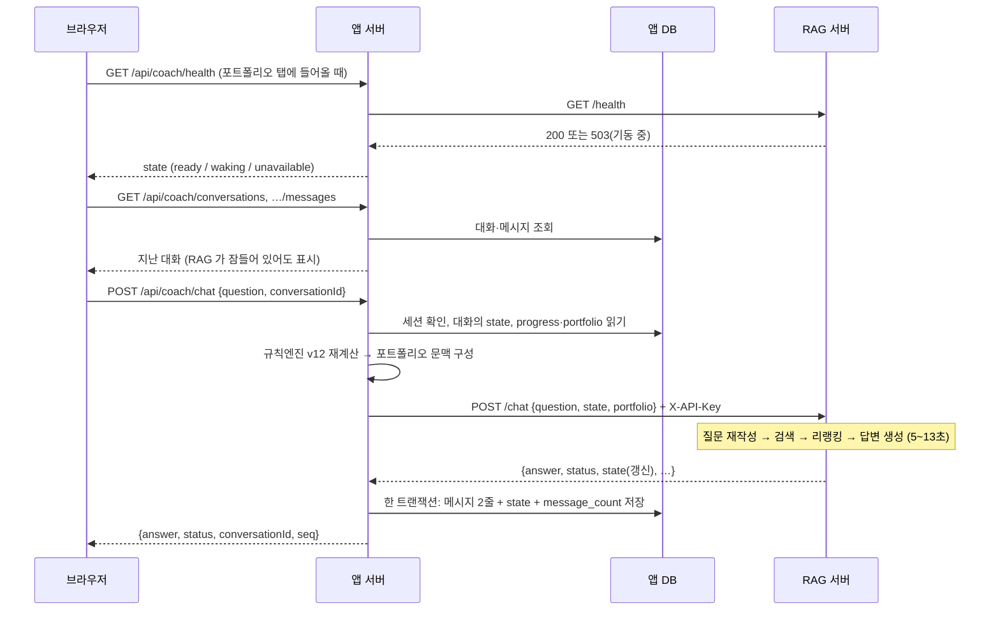

# 투리니 API 명세

작성 2026-10-03 · 기준 커밋 `19050a5` · 대상: 앱 팀(백엔드·프론트) · RAG 팀

| 표시 | 뜻 |
|---|---|
| **현행** | 지금 코드에 있는 API. 코드에서 그대로 옮김 |
| **제안** | RAG 연동을 위해 앱이 새로 만들 API. 아직 구현·합의 전 |
| **확인 필요** | RAG 팀과 맞춰야 확정되는 것 |

데이터 구조는 `docs/ERD.md` 에 있다.

### 구현 상태 (2026-10-03)

| 부분 | 상태 |
|---|---|
| 2절 앱 API | 현행 (배포됨) |
| 3절 AI 코치 채팅 API · 대화 테이블 · 화면 | **앱 쪽 구현 완료, 미배포.** 실제 RAG 서버 대신 `scripts/mock-rag.mjs` 로 확인함 |
| 4절 포트폴리오 문맥 | 구현 완료 (`app/coach-context.ts`). 예시 파일과 엔진 출력이 같은지 테스트가 확인한다 |
| 5절 RAG 서버 `/chat` 변경 | **RAG 팀 작업 대기** |

"제안" 표시는 RAG 팀과 합의하기 전이라는 뜻으로 남겨 둔다. 합의로 형식이 바뀌면 이 문서를 먼저 고치고 코드를 맞춘다.

---

## 1. 구성

```
브라우저 ──(쿠키 세션)──> 앱 서버 (Next.js, Render) ──(HTTPS, X-API-Key)──> RAG 서버 (Google Cloud Run) ──> OpenAI · Cohere
                              │                                              저장소 없음
                              ├─> Neon Postgres (회원·학습·포트폴리오·대화)
                              └─> OpenAI (포트폴리오 한 줄 코칭)
```

- 브라우저는 **앱 서버만** 호출한다. RAG 서버와 OpenAI 는 앱 서버가 대신 호출한다 (키 노출 방지).
- **대화는 앱이 저장한다.** RAG 서버는 DB 를 쓰지 않고, 요청으로 받은 질문·문맥·포트폴리오만으로 답한다. RAG 서버를 저장소 없이 두면 호스팅을 옮길 때 서버만 옮기면 된다 (지금은 Google Cloud Run, 무료 크레딧 90일).
- AI 코치 채팅은 포트폴리오 탭의 **AI 코치** 탭 안에 들어간다. 지금 그 탭에 있는 한 번짜리 코칭(`/api/portfolio-feedback`)은 그대로 두고, 그 아래에 채팅을 붙인다.

### 공통 규약 (현행)

| 항목 | 내용 |
|---|---|
| 주소 | 앱과 같은 출처. 경로는 전부 `/api/...` |
| 형식 | 요청·응답 모두 JSON (`Content-Type: application/json`) |
| 인증 | 쿠키 `turini_session` (httpOnly, sameSite=lax, 운영에서는 secure). 로그인·가입 때 서버가 심는다. 서버 쪽 유효기간 30일 |
| 오류 본문 | `{ "error": "사용자에게 보여줄 한국어 문장" }` |
| 공통 오류 | `401` 로그인 필요 · `503` DB 미연결 또는 연결 실패 |

---

## 2. 앱 API — 현행

### 2-1. 요약

| 메서드 | 경로 | 인증 | 용도 |
|---|---|---|---|
| GET | `/api/auth/check?username=` | 없음 | 아이디 중복 확인 |
| POST | `/api/auth/register` | 없음 | 가입 + 자동 로그인 |
| POST | `/api/auth/login` | 없음 | 로그인 |
| POST | `/api/auth/logout` | 쿠키 | 로그아웃 |
| GET | `/api/account` | 쿠키 | 내 계정·학습 기록·포트폴리오 불러오기 |
| PUT | `/api/account` | 쿠키 | 학습 기록·포트폴리오 저장 (통째로 덮어씀) |
| DELETE | `/api/account` | 쿠키 + PIN | 탈퇴 |
| POST | `/api/portfolio-feedback` | 쿠키 | 포트폴리오 한 줄 코칭 (LLM) |
| GET | `/data/quizData_864_FINAL.json` | 없음 | 학습 문항 (정적 파일) |
| GET | `/data/diagnostic_quiz.json` | 없음 | 진단 문항 (정적 파일) |

### 2-2. 인증

**`GET /api/auth/check?username=투리니`**

| 응답 | 본문 |
|---|---|
| 200 | `{ "available": true }` |
| 400 | 아이디 형식 오류 (3~20자, 한글·영문·숫자·`_`·`-`) |

**`POST /api/auth/register`** · **`POST /api/auth/login`**

요청
```json
{ "username": "투리니", "pin": "1234" }
```

응답 (가입 201, 로그인 200) — `Set-Cookie: turini_session=...`
```json
{ "account": { "username": "투리니" }, "progress": {}, "portfolio": {} }
```

| 코드 | 상황 |
|---|---|
| 400 | 아이디 형식 오류, 또는 PIN 이 숫자 4자리가 아님 |
| 401 | (로그인) 아이디 또는 PIN 불일치 |
| 409 | (가입) 이미 쓰는 아이디 |
| 429 | (로그인) 5회 연속 실패로 5분 잠금 |

**`POST /api/auth/logout`** → `{ "ok": true }`. 세션 행과 쿠키를 지운다.

### 2-3. 계정

**`GET /api/account`** → 200
```json
{
  "account": { "username": "투리니" },
  "progress": { "xp": 120, "tendency": "안정형", "financeLevel": "초급", "weakTags": ["분산투자 기본 원리"], "...": "ERD 3-1절" },
  "portfolio": { "allocation": { "domestic": 0.55, "overseas": 0.1, "bond": 0.05, "equityFund": 0, "cash": 0.3, "gold": 0 }, "horizon": "3~10년", "inputMode": "actual", "result": { "...": "PortfolioResult" }, "ruleVersion": "5.0.0-portfolio-v12", "...": "ERD 3-2절" }
}
```

**`PUT /api/account`** — 프론트가 상태가 바뀔 때마다 자동 저장한다. 부분 수정이 아니라 두 덩어리를 통째로 덮어쓴다.

요청
```json
{ "progress": { }, "portfolio": { } }
```

| 코드 | 상황 |
|---|---|
| 200 | `{ "ok": true }` |
| 400 | `progress` 또는 `portfolio` 가 객체가 아님 |
| 413 | 본문이 1,500,000자를 넘음 |

**`DELETE /api/account`** — 요청 `{ "pin": "1234" }` → `{ "ok": true }`. PIN 이 틀리면 401. 사용자 행을 지우면 세션도 함께 지워진다.

### 2-4. 포트폴리오 한 줄 코칭

**`POST /api/portfolio-feedback`**

요청 — 서버는 `context` 만 읽는다. 브라우저가 보낸 계산 결과는 믿지 않고 `allocation`·`tendency`·`horizon` 으로 **서버에서 규칙엔진을 다시 돌린다.**
```json
{
  "context": {
    "allocation": { "domestic": 0.55, "overseas": 0.1, "bond": 0.05, "equityFund": 0, "cash": 0.3, "gold": 0 },
    "tendency": "안정형",
    "horizon": "3~10년",
    "inputMode": "actual",
    "weakTags": ["분산투자 기본 원리"]
  }
}
```

응답 200
```json
{
  "feedback": {
    "summary_ko": "서비스 변동성 위험은 3등급이고 …",
    "strengths": ["자산을 섞은 효과로 위험이 2등급(높음)에서 3등급(다소 높음)으로 1단계 낮아져 있어요."],
    "cautions": ["성장자산 비중이 60%보다 높아 성장성과 변동성이 모두 높은 구조예요."],
    "improvements": ["국내주식 비중을 40%p 줄이는 방향이에요.", "현금성자산 비중을 40%p 늘리는 방향이에요."],
    "concept_refs": ["분산투자 기본 원리"]
  }
}
```

- `strengths`·`cautions`·`improvements` 는 LLM 출력이 아니라 **규칙엔진 계산값**이다. LLM 은 `summary_ko` 한 문단만 쓰고, 그 문단에 계산에 없는 숫자·금액·매수 권유가 있으면 서버가 정해진 문장으로 바꾼다.
- `concept_refs` 는 학습 태그 20종 중 1~3개.

| 코드 | 상황 |
|---|---|
| 400 | 비중 합이 1 이 아니거나 성향·기간 값이 잘못됨 |
| 429 | 사용자당 1분에 10회 초과 (서버 메모리 기준이라 재시작하면 초기화) |
| 502 | OpenAI 오류 또는 응답 해석 실패 |
| 503 | 서버에 `OPENAI_API_KEY` 없음 |
| 504 | 25초 안에 응답 없음 |

---

## 3. AI 코치 채팅 — 제안

질문은 RAG 서버로 보내 답을 받고, 대화는 앱 DB 에 저장한다. 목록·내역·제목 변경·삭제는 RAG 를 거치지 않고 앱 DB 만으로 처리한다.

### 3-1. 요약

| 메서드 | 경로 | 처리 방식 | 용도 |
|---|---|---|---|
| GET | `/api/coach/health` | RAG `GET /health` | 기동 여부 확인·깨우기 (3-6절) |
| POST | `/api/coach/chat` | RAG `POST /chat` + 앱 DB 저장 | 질문 → 답변 |
| GET | `/api/coach/conversations` | 앱 DB | 내 대화 목록 |
| GET | `/api/coach/conversations/{id}/messages?limit=&beforeSeq=` | 앱 DB | 대화 내역 |
| PATCH | `/api/coach/conversations/{id}` | 앱 DB | 제목 변경 |
| DELETE | `/api/coach/conversations/{id}` | 앱 DB | 대화 삭제 |

전부 쿠키 인증이 필요하다. 응답 필드는 앱의 다른 API 처럼 camelCase 로 준다. `chat` 과 `health` 를 뺀 네 개는 RAG 서버가 잠들어 있어도 동작한다.

### 3-2. `POST /api/coach/chat`

요청
```json
{ "question": "내 포트폴리오에서 채권을 늘리면 뭐가 달라져?", "conversationId": "5f0c2b1e-7a44-4c0e-9d2b-3a1f6e8c9b10" }
```

| 필드 | 필수 | 설명 |
|---|---|---|
| `question` | 예 | 1~500자. 앞뒤 공백을 지운 뒤 비어 있으면 400 |
| `conversationId` | 아니오 | 없으면 새 대화를 만든다. 응답으로 받은 값을 다음 질문에 넣는다 |

브라우저는 포트폴리오도 문맥도 보내지 않는다. 둘 다 서버가 DB 에서 읽는다.

서버 처리 순서

1. 쿠키 세션으로 사용자를 확인한다.
2. `conversationId` 가 있으면 그 대화를 `user_id` 조건과 함께 읽는다 (없거나 남의 대화면 404). 없으면 새 id 를 만든다 (아직 저장하지 않음).
3. `turini_users` 의 `progress`·`portfolio` 로 포트폴리오 문맥을 만든다 (4절). 규칙엔진은 서버에서 다시 돌린다.
4. RAG `POST /chat` 에 질문, 저장해 둔 `state`, 포트폴리오 문맥을 보낸다 (5절).
5. 답이 오면 **한 트랜잭션으로** 저장한다: user 메시지 1줄, assistant 메시지 1줄, 갱신된 `state`, `message_count + 2`, `updated_at`. 새 대화면 대화 행도 이때 만든다 (제목 = 질문 앞 40자).
6. RAG 호출이 실패하면 **아무것도 저장하지 않는다.** 프론트는 입력했던 질문을 그대로 두고 다시 보낼 수 있게 한다.

같은 대화에 질문이 동시에 두 개 들어오면 순번이 겹친다. 5번의 갱신에 `WHERE message_count = <읽었던 값>` 조건을 걸어, 그 사이에 다른 질문이 먼저 저장됐으면 409 를 준다.

응답 200
```json
{
  "conversationId": "5f0c2b1e-7a44-4c0e-9d2b-3a1f6e8c9b10",
  "answer": "채권 비중을 늘리면 …",
  "status": "generated",
  "seq": 4,
  "isNewConversation": false,
  "needsPortfolio": false
}
```

`seq` 는 방금 저장한 assistant 메시지의 순번이다.

| `status` | 화면 처리 |
|---|---|
| `generated` | 답변 표시 |
| `direct` | 답변 표시 (인사, 범위 밖 질문에 대한 정해진 문구) |
| `clarify` | 답변 표시 (되묻는 문장) |
| `portfolio_required` | 답변 표시 + "포트폴리오 분석하기" 버튼 |

어느 경우든 `answer` 에 보여줄 문장이 들어 있으므로 프론트는 항상 `answer` 를 그린다. RAG 응답의 나머지 필드(`route`, `retrieval_query`, `degraded`, `latency_s` 등)는 `turini_messages.meta` 에 저장하고 브라우저에는 내려보내지 않는다.

| 코드 | 상황 | 프론트 처리 |
|---|---|---|
| 400 | 질문이 비었거나 500자 초과 | 입력창 안내 |
| 401 | 로그인 필요 | 로그인 화면 |
| 404 | 없는 대화이거나 다른 사용자의 대화 | `conversationId` 를 버리고 새 대화로 다시 보냄 |
| 409 | 같은 대화에 다른 질문이 먼저 저장됨 | 내역을 다시 불러온 뒤 재시도 |
| 429 | 사용자당 1분에 10회 초과 | 잠시 후 안내 |
| 502 | RAG 가 예상 밖 오류를 돌려줌 | 다시 시도 안내 |
| 503 | RAG 기동 중, 또는 `RAG_API_URL` 미설정. `Retry-After: 10` 헤더 포함 | "코치를 깨우는 중" 표시 후 자동 재시도 |
| 504 | 70초 안에 응답 없음 | 다시 시도 안내 |

**응답 시간**: 보통 5~13초, RAG 서버가 내려가 있었으면 1분 가까이. 프론트는 답을 기다리는 동안 캐릭터의 생각 중 동작과 "답변 작성 중" 문구를 보여주고 입력창을 잠근다. 스트리밍은 쓰지 않는다.

### 3-3. 대화 목록·내역·제목·삭제

전부 앱 DB 만 쓴다. 모든 쿼리에 `WHERE user_id = <세션의 사용자>` 조건을 붙이므로 다른 사용자의 대화는 조회·수정되지 않고, 남의 대화 id 를 넣으면 404 를 준다.

**`GET /api/coach/conversations`** → 200 (최근 순, 최대 50개)
```json
{ "conversations": [ { "conversationId": "5f0c…", "title": "ETF 와 펀드 차이", "updatedAt": "2026-10-03T08:12:00Z", "messageCount": 6 } ] }
```

**`GET /api/coach/conversations/{id}/messages?limit=30&beforeSeq=31`** → 200
```json
{ "messages": [ { "seq": 1, "role": "user", "content": "ETF 가 뭐야?", "createdAt": "2026-10-03T08:10:00Z" },
                { "seq": 2, "role": "assistant", "content": "ETF 는 …", "createdAt": "2026-10-03T08:10:07Z", "status": "generated" } ] }
```

`limit` 은 1~50 (기본 30). `beforeSeq` 를 주면 그보다 앞선 메시지를 가져온다 (위로 스크롤할 때 더 불러오기). `status` 는 assistant 메시지에만 있고 `meta.status` 에서 온다.

**`PATCH /api/coach/conversations/{id}`** 요청 `{ "title": "새 제목" }` (1~80자) → `{ "ok": true }`

**`DELETE /api/coach/conversations/{id}`** → `{ "ok": true }`. 메시지는 함께 삭제된다.

### 3-4. 탈퇴와의 연결

코드를 바꿀 것이 없다. `DELETE /api/account` 가 사용자 행을 지우면 대화와 메시지가 외래키 CASCADE 로 함께 지워진다. RAG 서버에는 저장된 것이 없으므로 따로 요청할 것도 없다.

### 3-5. 흐름



### 3-6. 깨우기 — `GET /api/coach/health`

RAG 서버는 뜰 때 검색 데이터를 내려받고 색인을 메모리에 올리느라 **약 40초**가 걸린다. Cloud Run 은 설정에 따라 두 가지로 동작한다.

| 최소 인스턴스 | 동작 | 쓰는 때 |
|---|---|---|
| 0 | 요청이 한동안(약 15분) 없으면 서버를 내린다. 다음 첫 요청은 40초 이상 걸린다. 쓴 만큼만 과금 | 개발 기간 |
| 1 | 서버 한 대를 항상 켜 둔다. 기동 대기가 없다. 켜 둔 시간만큼 과금 | 전시 1~2주 전부터 |

최소 인스턴스가 1 이면 이 절의 대응은 거의 쓰이지 않지만, 배포 직후나 장애 복구 중에는 같은 상황이 생기므로 화면 처리는 그대로 둔다. 0 인 동안에는 **질문하기 전에 미리 깨운다.**

응답 200 (항상 200 을 주고 상태는 본문으로 구분)
```json
{ "state": "ready" }
```

| `state` | 판정 기준 (앱 서버 → RAG `/health`, 5초 제한) | 프론트 처리 |
|---|---|---|
| `ready` | 200 | 입력창 활성화 |
| `waking` | 503, 시간 초과, 연결 실패 | "코치를 깨우는 중이에요" 표시, 입력창 잠금, 5초마다 다시 호출 (최대 90초) |
| `unavailable` | `RAG_API_URL` 미설정, 또는 90초가 지나도 `ready` 가 안 됨 | 입력창을 숨기고 한 줄 코칭과 지난 대화만 표시. "다시 시도" 버튼 |

호출 시점

1. **포트폴리오 탭에 들어올 때** — 사용자가 비중을 입력하고 분석 결과를 읽는 동안(보통 1분 이상) RAG 가 깨어난다.
2. **AI 코치 탭을 열 때** — 아직 `ready` 가 아니면 위 표대로 표시.
3. `waking` 인 동안 5초 간격 재호출.

지난 대화 내역은 앱 DB 에서 읽으므로 `waking` 중에도 화면에 보인다. 잠긴 것은 입력창뿐이다.

---

## 4. 포트폴리오 문맥 — 앱이 RAG 에 보내는 형식 (제안)

`POST /chat` 의 `portfolio` 칸에 들어간다. RAG 팀이 테스트해 온 형식(`diagnosis` + `portfolio`)을 따르고, **규칙엔진 계산 결과 `computed`** 를 더한다.

| 파일 | 내용 |
|---|---|
| `docs/rag/portfolio-context.schema.json` | JSON Schema (draft-07). 필드별 뜻과 답변에서 지킬 규칙이 `description` 에 적혀 있다 |
| `docs/rag/portfolio-context.example.json` | 아래 예시와 같은 파일 |

예시 — 안정형 · 초급 · 3~10년 · 국내주식 55 / 해외주식 10 / 채권 5 / 현금성자산 30

```json
{
  "schema_version": "turini-portfolio-context/1",
  "diagnosis": {
    "diagnosed": true,
    "risk_type": "안정형",
    "level_type": "초급",
    "weak_tags": [
      "분산투자 기본 원리",
      "위험-수익 관계"
    ]
  },
  "portfolio": {
    "input_mode": "실제",
    "investment_horizon": "3~10년",
    "allocation": {
      "국내주식": 0.55,
      "해외주식": 0.1,
      "채권": 0.05,
      "현금성자산": 0.3
    }
  },
  "computed": {
    "engine_version": "5.0.0-portfolio-v12",
    "sigma_asof": "2026-09-18",
    "risk_score": 19.01,
    "risk_var": 28.62,
    "risk_grade": 3,
    "risk_grade_name": "다소 높음",
    "downside_6m": -19.84,
    "fit_type_ok": false,
    "fit_type_label": "성향보다 많이 공격적이에요",
    "type_range": [
      0,
      6.61
    ],
    "fit_horizon_ok": false,
    "fit_horizon_label": "기간에 비해 위험이 많이 커요",
    "horizon_cap": 11.09,
    "characteristics": {
      "growth": "높음",
      "defense": "보통",
      "liquidity": "높음"
    },
    "recommendation_status": "recommended",
    "near_target": {
      "allocation": {
        "국내주식": 0.15,
        "해외주식": 0.1,
        "채권": 0.05,
        "현금성자산": 0.7
      },
      "risk_score": 5.85,
      "risk_var": 9.7,
      "risk_grade": 5,
      "risk_grade_name": "낮음",
      "downside_6m": -6.57
    },
    "base_target": {
      "allocation": {
        "국내주식": 0.05,
        "해외주식": 0.1,
        "채권": 0.45,
        "주식형 ETF·펀드": 0.05,
        "현금성자산": 0.3,
        "금": 0.05
      },
      "risk_score": 4,
      "risk_var": 7.62,
      "risk_grade": 5,
      "risk_grade_name": "낮음",
      "downside_6m": -4.54
    },
    "rebalancing_actions": [
      {
        "asset_class": "국내주식",
        "delta_pp": -40,
        "action": "축소"
      },
      {
        "asset_class": "현금성자산",
        "delta_pp": 40,
        "action": "확대"
      }
    ],
    "signals": [
      {
        "id": 1,
        "kind": "caution",
        "text": "성장자산 비중이 60%보다 높아 성장성과 변동성이 모두 높은 구조예요."
      },
      {
        "id": 5,
        "kind": "structural",
        "text": "현금성자산 비중이 20%보다 높아 유동성은 좋지만 성장성이 제한될 수 있어요."
      }
    ],
    "strengths": [
      "자산을 섞은 효과로 위험이 2등급(높음)에서 3등급(다소 높음)으로 1단계 낮아져 있어요."
    ],
    "cautions": [
      "연환산 변동성 19.01%는 안정형 기준 범위 0~6.61% 밖이라 성향보다 많이 공격적이에요.",
      "3~10년 투자기간이 허용하는 위험 상한은 11.09%인데 지금은 19.01%라 기간에 비해 위험이 많이 커요.",
      "성장자산 비중이 60%보다 높아 성장성과 변동성이 모두 높은 구조예요."
    ]
  }
}
```

`computed` 는 이 입력을 현재 엔진(`5.0.0-portfolio-v12`, 주간 자료 기준 임시 상수)에 넣어 나온 실제 값이다. 상수를 일간 자료로 다시 산출하면 숫자가 바뀐다. 스키마는 성향 4종 × 기간 4종 × 배분 399종 = 6,384건의 엔진 출력으로 검증했다 (전부 통과).

### 필드

| 필드 | 값 | 출처 (앱 저장값·엔진 출력) |
|---|---|---|
| `schema_version` | `turini-portfolio-context/1`. 필드가 바뀌면 숫자를 올린다 | — |
| `diagnosis.diagnosed` | 진단을 마쳤는지 | `progress.tendency` 가 `진단 전` 이 아니면 true |
| `diagnosis.risk_type` | `안정형`\|`중립형`\|`공격형` | `progress.tendency`. 진단 전이면 `중립형` |
| `diagnosis.level_type` | `초급`\|`중급`\|`고급`\|null | `progress.financeLevel`. 진단 전이면 null |
| `diagnosis.weak_tags` | 문자열 배열, 최대 10개 | `progress.weakTags` |
| `portfolio.input_mode` | `실제`\|`연습` | `portfolio.inputMode` (`actual`/`practice`) |
| `portfolio.investment_horizon` | `1년 미만`\|`1~3년`\|`3~10년`\|`10년 이상` | `portfolio.horizon` |
| `portfolio.allocation` | 자산군 한글 이름 → 비율 0~1 (합 1). 0 인 자산군은 뺀다 | `portfolio.allocation` |
| `computed.risk_score` · `risk_var` | 연환산 변동성(%), 역사적 VaR(%). 소수 2자리 | `riskScore` · `riskVar` |
| `computed.risk_grade` · `risk_grade_name` | 1(가장 위험)~6(가장 안전) | `riskGrade` · `riskGradeName` |
| `computed.downside_6m` | 6개월 하방 추정(%, 0 이하) | `downside6m` |
| `computed.fit_type_ok` · `fit_type_label` · `type_range` | 성향 적합 여부, 판정 문구, 성향의 변동성 범위 | `typeFitLabel` · `profileRange` |
| `computed.fit_horizon_ok` · `fit_horizon_label` · `horizon_cap` | 기간 적합 여부, 판정 문구, 기간의 변동성 상한 | `horizonFitLabel` · `horizonCap` |
| `computed.characteristics` | 성장성·방어력·유동성 각각 `낮음`\|`보통`\|`높음` | `characteristics` |
| `computed.recommendation_status` | `hold`\|`recommended`\|`horizon_capped`\|`no_feasible_target` | `recommendationStatus` |
| `computed.near_target` | 조정안. `hold`·`no_feasible_target` 이면 null | `nearTarget` |
| `computed.base_target` | 성향의 기준 배분 (참고용) | `baseTarget` |
| `computed.rebalancing_actions` | `{asset_class, delta_pp, action}` 배열. `delta_pp` 는 퍼센트포인트 | `rebalancingActions` |
| `computed.signals` | `{id, kind, text}` 배열. `kind` 가 `caution` 인 것만 주의점 | `signals` |
| `computed.strengths` · `cautions` | 화면에 보이는 강점·주의점 문장 그대로 | `strengths` · `cautions` |

자산군 이름은 여섯 개로 고정이다: `국내주식` · `해외주식` · `주식형 ETF·펀드` · `채권` · `현금성자산` · `금`.

엔진 출력 중 **보내지 않는 것**: 내부 적합도 수치(`fit`, `horizonFit`, `riskLevel`), 분산효과 계산 중간값, 5%p 미만의 잔여 차이(`residualItems` — 코치가 언급하지 않는 항목이다).

### RAG 팀 예시 형식과 다른 점

| 항목 | RAG 예시 | 앱 제안 | 이유 |
|---|---|---|---|
| `sample_id` | 있음 | 없음 | 평가셋용 식별자라 운영 요청에는 의미가 없다 |
| `style_score` · `level_score` | 있음 | 없음 | 앱이 진단 원점수를 저장하지 않는다. 필요하면 저장하도록 바꿀 수 있다 (확인 필요) |
| `total_amount_krw` | 있음 | **보내지 않음** | 포트폴리오 코치는 금액을 말하지 않는 것이 규칙이다 (비율·등급으로만 설명). 금액이 문맥에 있으면 답변에 금액이 나와도 걸러낼 근거가 없어진다. 개인 자산 규모를 외부 서비스로 내보내지 않는다는 이유도 있다 |
| `investment_horizon` | 없음 | 있음 | v12 에서 기간이 판정 축이다 (기간 상한) |
| `computed` | 없음 | 있음 | 아래 참조 |

### `computed` 를 보내는 이유

포트폴리오의 등급과 판정은 규칙엔진이 정한다. RAG 의 LLM 이 비율만 보고 따로 판단하면 같은 화면의 요약 탭과 채팅이 서로 다른 말을 하게 된다 (예: 화면은 3등급인데 채팅은 "안정적인 편"). 그래서 채팅 답변이 포트폴리오를 평가할 때는 **`computed` 의 등급·판정 문구·조정안을 그대로 인용**하고, RAG 는 그 결과가 무슨 뜻인지를 검색한 금융 자료로 설명하는 역할을 맡는 것을 제안한다.

RAG 답변 프롬프트에 넣어 주면 좋은 규칙:

- 위험등급·성향 적합·기간 적합은 `computed` 값을 그대로 쓴다. 새로 판정하지 않는다. 판정 문구(`fit_type_label`, `fit_horizon_label`)는 화면과 같은 문장이므로 바꿔 쓰지 않는다.
- 비중을 어떻게 바꿀지는 `computed.rebalancing_actions` 안에서만, 그 순서대로 말한다. 없는 자산군을 늘리라고 하지 않는다.
- 주의점은 `computed.cautions` 에 있는 것만 말한다. `signals` 중 `kind` 가 `structural` 인 것은 주의점이 아니다.
- `strengths` 가 비어 있으면 강점을 만들어 말하지 않는다.
- `computed` 에 없는 숫자와 금액을 만들지 않는다. `risk_var` 와 `downside_6m` 은 실제 손실 한도가 아니라는 점을 지킨다.
- `recommendation_status` 가 `horizon_capped` 이면 투자기간 기준을 우선한 조정안이라는 점을 함께 말한다.
- `diagnosis.diagnosed` 가 false 이면 성향은 기본값(중립형)이므로, 성향 판정을 말할 때 진단을 먼저 권한다.

### 포트폴리오를 보내지 않는 경우

분석을 한 번도 하지 않았거나(`portfolio.result` 가 없음) 저장된 결과의 엔진 버전이 지금과 다르면 `portfolio` 칸을 뺀다. 그 상태에서 포트폴리오가 필요한 질문이 오면 RAG 가 `status: "portfolio_required"` 를 돌려주고, 프론트는 분석 화면으로 가는 버튼을 보여준다.

---

## 5. RAG 서버 API — 앱이 호출하는 쪽 (RAG 팀에 변경 요청)

RAG 팀 연동 문서의 **안 B** 다. 지금 구현(RAG 가 대화를 저장)에서 아래처럼 바뀌어야 한다.

| 메서드 | 경로 | 지금 | 요청 |
|---|---|---|---|
| GET | `/health` | 있음 | 그대로 |
| POST | `/chat` | `conversation_id` 로 저장된 문맥을 찾아 씀 | **`state` 를 요청으로 받고 응답으로 돌려줌.** 저장하지 않음 |
| GET·PATCH·DELETE | `/conversations…` | 있음 | **필요 없음** (앱 DB 가 처리) |

인증은 그대로 `X-API-Key` 헤더다.

### `POST /chat` (요청하는 형태)

요청
```json
{
  "question": "그럼 펀드랑은 뭐가 달라?",
  "state": { "…": "직전 응답에서 받은 값 그대로. 새 대화의 첫 질문이면 null" },
  "portfolio": { "…": "4절의 포트폴리오 문맥. 없으면 생략" },
  "user_id": "f3b0c9a2-…"
}
```

| 필드 | 필수 | 설명 |
|---|---|---|
| `question` | 예 | 사용자 질문 |
| `state` | 예 (null 가능) | 모델용 문맥. 앱은 내용을 해석하지 않고 받은 그대로 저장했다가 돌려보낸다. null 이면 새 대화 |
| `portfolio` | 아니오 | 4절 |
| `user_id` | 아니오 | UUID v4 문자열. 답변 추적 로그를 사용자별로 묶을 때만 쓴다. 답변 생성에는 필요 없다 |

응답
```json
{
  "answer": "펀드와 ETF는 모두 여러 종목에 분산 투자하지만 …",
  "status": "generated",
  "state": { "…": "이번 질문·답변을 반영한 새 문맥" },
  "needs_portfolio": false,
  "route": "rag",
  "is_followup": true,
  "retrieval_query": "ETF와 펀드의 차이점은 무엇인가?",
  "profile": "v2_4j",
  "degraded": false,
  "latency_s": 5.1
}
```

| 지금 응답에서 빠지는 것 | 이유 |
|---|---|
| `conversation_id` · `is_new_conversation` | 대화 id 는 앱이 발급하고 관리한다 |
| `seq` | 메시지 순번은 앱이 매긴다 |

`state` 에 대한 약속

- 한 대화의 `state` 는 64KB 이하 (앱은 JSONB 한 칸에 저장한다).
- `state` 만 있으면 다음 질문에 답할 수 있어야 한다. RAG 서버의 메모리나 디스크에 대화별 정보를 남겨 두고 그것에 의존하지 않는다 (컨테이너가 재시작하면 사라진다).
- 포트폴리오 값은 `state` 에 넣지 않는다. 매 요청에 `portfolio` 로 새로 보낸다.
- `state` 의 내부 구조는 RAG 팀이 자유롭게 바꿀 수 있다. 다만 **예전 구조의 `state` 를 받아도 오류 없이 처리**해야 한다 (앱 DB 에 예전 값이 남아 있다). 못 읽는 구조면 새 대화처럼 처리한다.

### 앱 → RAG 오류 변환

| RAG | 앱이 브라우저에 주는 것 |
|---|---|
| 401 | 502 (앱 서버 설정 오류이므로 사용자에게는 일반 오류로) + 서버 로그 |
| 422 | 400 |
| 503 | 503 + `Retry-After` |
| 시간 초과·연결 실패 | 504 |
| 그 밖의 5xx | 502 |

---

## 6. RAG 팀과 맞출 것

### RAG 팀 확인 요청에 대한 앱 쪽 답 (제안)

| # | 질문 | 앱 쪽 답 |
|---|---|---|
| 1 | 대화 테이블 소유 | **안 B (앱 소유).** RAG 서버는 저장하지 않고 `/chat` 에서 `state` 를 주고받는다. 이유는 아래 "배포 제약" |
| 2 | `user_id` 형식·탈퇴 처리 | UUID v4 문자열 (하이픈 포함 36자). RAG 에는 로그용으로만 보낸다. 탈퇴는 앱 DB 의 외래키로 끝나므로 RAG 쪽 작업 없음 |
| 3 | 포트폴리오 형식 | 4절, `docs/rag/portfolio-context.schema.json` |
| 4 | 호출 위치 | 앱 서버에서만 호출. 브라우저 직접 호출 없음 |
| 5 | 배포 위치·키 전달 | Render 환경변수 `RAG_API_URL`, `RAG_API_KEY`. 값은 저장소에 올리지 않는다 |
| 6 | 스트리밍 | 지금은 필요 없음. 대기 중 표시로 처리한다 |

### RAG 팀에 요청하는 것

1. `/chat` 을 5절 형태로 변경 (`state` 입출력, 저장 제거).
2. `/conversations…` 엔드포인트와 대화 저장 코드는 쓰지 않으므로 제거해도 된다. RAG 서버의 `DATABASE_URL` 도 필요 없다.
3. `/health` 의 응답 본문 알려 주기. 그리고 `/health` 가 **검색 데이터 로딩까지 끝난 뒤에만 200** 을 주도록 하기 (프로세스만 떠도 200 이면, 준비가 안 된 서버로 질문이 들어간다. Cloud Run 의 시작 확인(startup probe)도 이 경로를 쓴다).
4. 4절의 `computed` 인용 규칙을 답변 프롬프트에 반영.

### 배포 구성 (Google Cloud Run)

| 항목 | 내용 |
|---|---|
| 방식 | RAG 팀의 Dockerfile 을 그대로 Cloud Run 서비스로 배포. HTTPS 주소가 자동으로 나오고 그것이 앱의 `RAG_API_URL` 이다 |
| 비용 | Google Cloud 무료 크레딧 (300달러, 가입 후 **90일**). 기간이 끝나거나 크레딧을 다 쓰면 자동 과금은 없고 **서버가 멈춘다** |
| 사양 | vCPU 1 · 메모리 2GB (RAG 가 약 900MB 사용) · 동시 처리 1~2 (워커 1개) |
| 최소 인스턴스 | 개발 기간 0, 전시 1~2주 전부터 1 (3-6절) |
| 요청 시간 제한 | 120초 이상으로 설정 (앱의 대기 70초보다 길게) |
| 지역 | 서울(`asia-northeast3`) 권장. 앱 서버와 사용자 모두 한국이다 |
| 접근 제어 | Cloud Run 은 "인증 없이 호출 허용"으로 열고 `X-API-Key` 로 막는다. URL 을 아는 누구나 요청을 보낼 수 있으므로 `RAG_API_KEY` 는 길고 무작위여야 한다 |
| 비밀 값 | `OPENAI_API_KEY` · `COHERE_API_KEY` · `RAG_API_KEY` · `HF_TOKEN` 은 Secret Manager 또는 Cloud Run 환경변수에 넣는다. 저장소와 Dockerfile 에 적지 않는다 |
| 디스크 | 컨테이너 안의 파일은 재시작하면 지워진다. 검색 데이터를 기동할 때 내려받는 지금 방식 그대로 동작한다 |
| 나가는 접속 | 포트 제한 없음 |

미리 정해 둘 것

- **누구 계정인지.** 크레딧은 계정당 한 번이다. 그 계정 주인만 배포·설정을 할 수 있으므로 팀원을 프로젝트에 추가해 둔다.
- **예산 알림.** 크레딧의 1/3, 2/3 지점에 알림을 건다. 최소 인스턴스 1 로 항상 켜 두는 비용은 배포 뒤 며칠간 결제 화면에서 실제 소진 속도로 확인한다.
- **90일 뒤.** 전시(2026-11-03~04)와 보고서 기간은 덮지만 그 뒤에는 멈춘다. 계속 운영하려면 그 전에 옮길 곳을 정한다. RAG 가 저장소 없이 동작하므로 옮길 것은 컨테이너뿐이다.

검토했다가 택하지 않은 곳: Hugging Face Space (Docker Space 생성에 유료 플랜이 필요하고, Postgres 포트로 나가는 접속이 막혀 있음) · Render 무료 (메모리 512MB 로 부족) · Vercel (요청마다 함수를 띄우는 방식이라 40초 기동이 자주 반복됨) · Netlify (파이썬 서버를 실행할 수 없음).

### 운영상 맞춰 둘 것

| 항목 | 내용 |
|---|---|
| 동시 처리 | RAG 워커가 1개라 요청이 겹치면 밀린다. 앱은 사용자당 1분에 10회로 제한한다 |
| 리랭커 한도 | Cohere 체험 키는 월 1,000회이고 2026년 10월분은 소진됐다. 전환 전까지는 `degraded: true` 로 답이 온다. 전시(2026-11-03~04) 전에 운영 키 전환 일정을 확인해야 한다 |
| 잠들기 | RAG 는 최소 인스턴스 설정으로 해결한다 (3-6절). **앱 서버(Render 무료)는 15분 동안 요청이 없으면 잠들고 깨는 데 약 1분이 걸린다.** 전시 기간에는 5~10분마다 앱 주소를 자동 호출해 잠들지 않게 한다 (Cloud Scheduler 를 쓰면 같은 크레딧 안에서 된다) |
| 시간 제한 | 앱 → RAG 70초. 지금 한 줄 코칭은 25초라 서로 다른 값을 쓴다 |

---

## 7. 환경변수

| 이름 | 서버 | 쓰는 곳 | 상태 |
|---|---|---|---|
| `DATABASE_URL` | 앱 | Neon Postgres 연결 | 현행 |
| `OPENAI_API_KEY` · `OPENAI_MODEL` | 앱 | 포트폴리오 한 줄 코칭 | 현행 |
| `RAG_API_URL` | 앱 | RAG 서버 주소 (Cloud Run 이 주는 HTTPS 주소) | 제안 |
| `RAG_API_KEY` | 앱 · RAG | `X-API-Key` 값. 양쪽이 같은 값 | 제안 |
| `OPENAI_API_KEY` · `COHERE_API_KEY` · `HF_TOKEN` | RAG | 외부 API, 비공개 검색 데이터 내려받기 | RAG 팀 관리 |

`RAG_API_URL` 이 없으면 채팅 API 는 503 을 주고, AI 코치 탭은 지금처럼 한 줄 코칭만 보여준다. RAG 없이도 앱이 뜬다.
