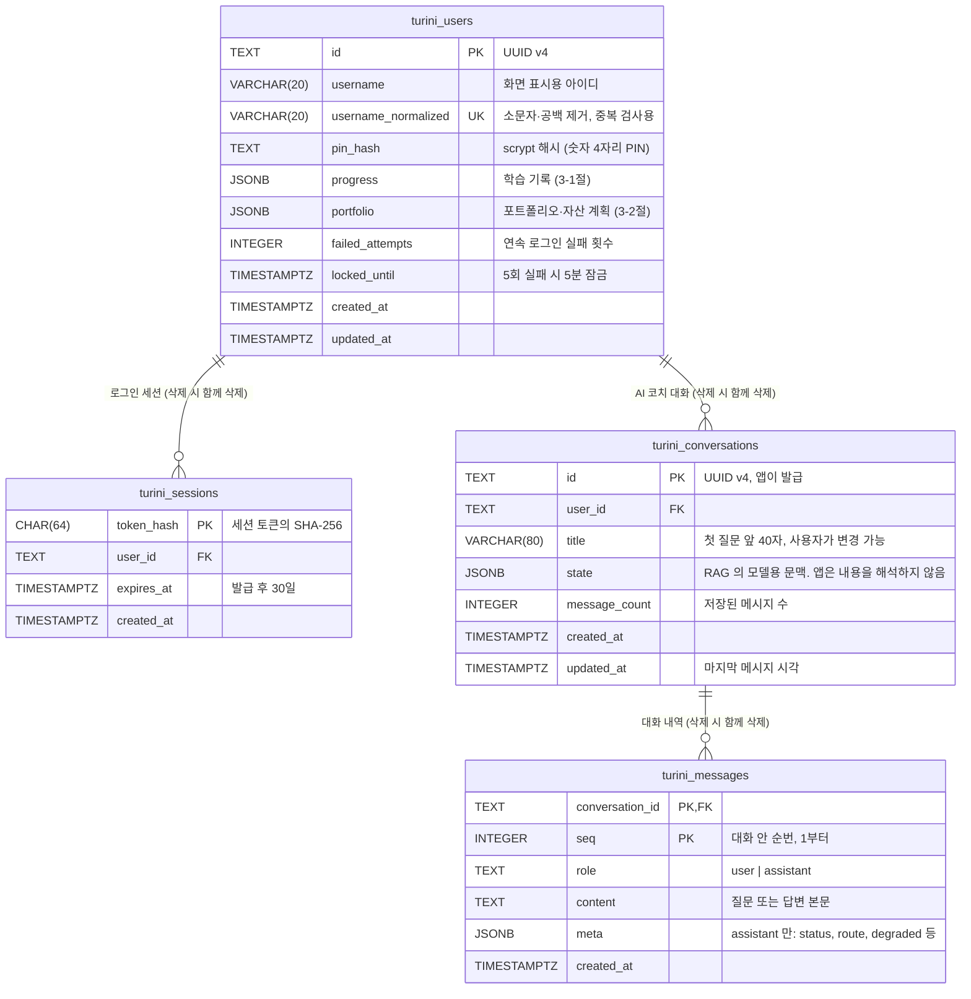
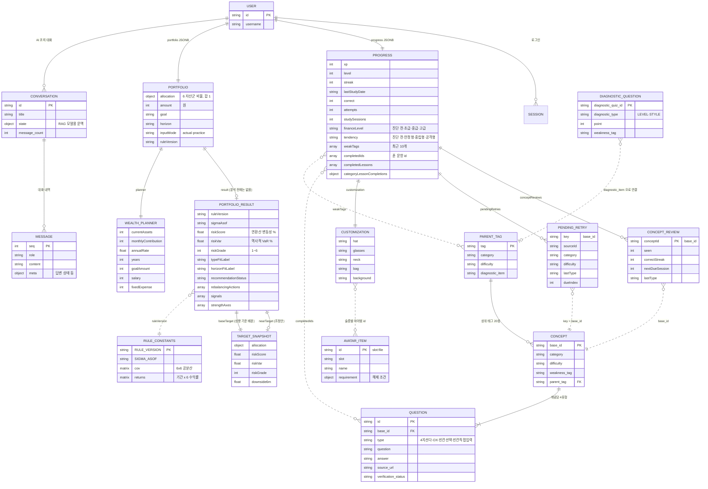

# 투리니 ERD

작성 2026-10-03 · 기준 커밋 `19050a5` (규칙엔진 v12 머지 직후) · 대상: 앱 팀(백엔드·프론트) · RAG 팀

이 문서는 세 가지를 구분해서 적는다.

| 표시 | 뜻 |
|---|---|
| **현행** | 지금 코드에 있는 것. 근거 파일을 함께 적음 |
| **제안** | RAG 연동을 위해 앱 팀이 제안하는 것. 아직 구현·합의 전 |
| **확인 필요** | RAG 팀 또는 앱 팀 내부에서 정해야 하는 것 |

API 는 `docs/API_SPEC.md` 에 있다.

---

## 1. 한눈에 보기

- 앱 DB 는 Neon Postgres 다. **현행 테이블 2개**(`turini_users`, `turini_sessions`)에 **대화 테이블 2개**(`turini_conversations`, `turini_messages`)를 더한다 (제안).
- 학습 기록과 포트폴리오는 `turini_users` 의 JSONB 두 칸에 통째로 들어간다.
- 문항·진단·아이템·규칙 상수는 **DB 가 아니라 파일**이다. 배포할 때 코드와 함께 올라간다.
- **RAG 서버는 DB 를 쓰지 않는다.** 대화 저장은 전부 앱이 한다. RAG 는 질문과 문맥을 받아 답변과 갱신된 문맥을 돌려주기만 한다.

```
 브라우저 ──> 앱 서버 (Next.js, Render) ──HTTPS──> RAG 서버 (Google Cloud Run) ──> OpenAI · Cohere
                   │                                  저장소 없음. 요청마다 받은 것으로만 답함
                   ▼
            Neon Postgres
              turini_users ──< turini_sessions
                   │  progress JSONB · portfolio JSONB
                   └──< turini_conversations ──< turini_messages      ← 제안 (신규)
 파일(DB 아님): 문항 864 · 진단 21 · 아이템 · 규칙 상수
```

### 왜 앱이 저장하는가

RAG 서버는 Google Cloud Run 에 올라간다 (무료 크레딧, 기간 90일). 크레딧이 끝나면 서버가 멈추므로 언젠가 다른 곳으로 옮겨야 한다. 대화를 RAG 서버 쪽에 두면 그때 데이터까지 옮겨야 하지만, 앱이 저장하면 서버만 옮기고 `RAG_API_URL` 을 바꾸면 끝난다. 그 밖에도 이점이 있다.

- 탈퇴 시 삭제가 외래키로 자동 처리된다.
- RAG 서버가 내려가 있어도 지난 대화를 볼 수 있다.
- RAG 서버에 DB 접속 정보를 줄 필요가 없다 (회원 테이블과 같은 DB 다).
- Cloud Run 의 컨테이너는 디스크가 재시작하면 지워지므로, 어차피 서버 안에는 대화를 둘 수 없다.

---

## 2. 물리 ERD — 실제 테이블



### 현행 테이블 (`app/server/db.ts` 의 `ensureSchema`)

| 테이블 | 인덱스 | 비고 |
|---|---|---|
| `turini_users` | `username_normalized` UNIQUE | `id` 는 `randomUUID()`. 마이그레이션 도구 없이 첫 요청 때 `CREATE TABLE IF NOT EXISTS` 로 만든다 |
| `turini_sessions` | `(user_id)`, `(expires_at)` | 쿠키에는 원본 토큰, DB 에는 해시만 저장. 만료된 세션은 새 세션을 만들 때 지운다 |

### 대화 테이블 (제안 — `ensureSchema` 에 추가)

```sql
CREATE TABLE IF NOT EXISTS turini_conversations (
  id            TEXT PRIMARY KEY,
  user_id       TEXT NOT NULL REFERENCES turini_users(id) ON DELETE CASCADE,
  title         VARCHAR(80) NOT NULL,
  state         JSONB,
  message_count INTEGER NOT NULL DEFAULT 0,
  created_at    TIMESTAMPTZ NOT NULL DEFAULT NOW(),
  updated_at    TIMESTAMPTZ NOT NULL DEFAULT NOW()
);
CREATE INDEX IF NOT EXISTS turini_conversations_user_updated_idx
  ON turini_conversations (user_id, updated_at DESC);

CREATE TABLE IF NOT EXISTS turini_messages (
  conversation_id TEXT NOT NULL REFERENCES turini_conversations(id) ON DELETE CASCADE,
  seq             INTEGER NOT NULL,
  role            TEXT NOT NULL CHECK (role IN ('user', 'assistant')),
  content         TEXT NOT NULL,
  meta            JSONB,
  created_at      TIMESTAMPTZ NOT NULL DEFAULT NOW(),
  PRIMARY KEY (conversation_id, seq)
);
```

| 열 | 설명 |
|---|---|
| `turini_conversations.state` | RAG 가 돌려준 모델용 문맥 (최근 메시지 몇 개 + 그 이전 대화의 요약). 앱은 받은 그대로 저장했다가 다음 질문 때 그대로 돌려보낸다. 새 대화의 첫 질문 전에는 NULL |
| `turini_messages` | 화면에 보여줄 전체 내역. `state` 는 오래된 대화를 요약으로 압축하므로 내역을 대신할 수 없다. 그래서 둘을 따로 둔다 |
| `turini_messages.meta` | assistant 메시지에만 있다. RAG 응답의 `status`·`route`·`degraded`·`latency_s`·`retrieval_query` 를 넣는다. 화면에는 `status` 만 쓴다 |
| `message_count` · `seq` | 질문 하나가 성공하면 user·assistant 두 줄이 한 번에 들어가고 `message_count` 가 2 늘어난다. RAG 호출이 실패하면 아무것도 저장하지 않는다 |

포트폴리오는 대화 테이블에 저장하지 않는다. 질문할 때마다 `turini_users.portfolio` 에서 읽어 RAG 에 보낸다.

---

## 3. 논리 ERD — JSONB 를 풀어서 본 구조

물리 테이블만 보면 구조가 보이지 않아서, JSONB 안의 묶음과 파일 데이터를 엔터티로 풀어 그렸다. 실선은 같은 저장 단위 안의 포함 관계, 점선은 id 로만 참조하는 관계(제약 없음)다.



### 3-1. `progress` JSONB (현행 — `app/page.tsx` 의 `type Progress`)

| 필드 | 타입 | 뜻 |
|---|---|---|
| `xp` · `level` | number | 경험치, 레벨 (`xp ÷ 100 + 1`) |
| `streak` · `lastStudyDate` | number · `YYYY-MM-DD`\|null | 연속 학습 일수 (한국 시간 기준 하루 1회) |
| `correct` · `attempts` | number | 누적 정답 수, 누적 응답 수 (합계만) |
| `studySessions` | number | 끝낸 학습 세션 수. 간격 반복의 시간 단위 |
| `completedIds` | string[] | 한 번이라도 푼 문항 id |
| `completedLessons` · `categoryLessonCompletions` | number[] · {카테고리: 수} | 레슨 완료 기록 |
| `financeLevel` | `진단 전`\|`초급`\|`중급`\|`고급` | 진단 수준 점수(54점 만점)가 21 이하 초급, 38 이하 중급, 그 위 고급 |
| `tendency` | `진단 전`\|`안정형`\|`중립형`\|`공격형` | 진단 성향 점수(9점 만점)가 4 이하 안정, 7 이하 중립, 그 위 공격 |
| `weakTags` | string[] | 진단·오답에서 모인 취약 태그, 최근 10개 |
| `conceptReviews` | {base_id: ConceptReview} | 개념별 복습 상태. 맞히면 1→3→7→14→30 세션 뒤 재출제 |
| `pendingRetries` | PendingRetry[] | 세션 끝에서 틀려 다음 세션으로 넘긴 재시도 |
| `customization` | {hat, glasses, neck, bag, background} | 슬롯별 착용 아이템 id 또는 null |

**저장되지 않는 것**: 진단의 원점수(수준 54점·성향 9점)는 세션이 끝나면 `financeLevel`·`tendency` 로만 남고 버려진다. 문항별 정답·오답·선택지도 저장하지 않는다.

### 3-2. `portfolio` JSONB (현행 — `AccountPayload.portfolio`)

| 필드 | 타입 | 뜻 |
|---|---|---|
| `allocation` | {domestic, overseas, bond, equityFund, cash, gold} | 비율 0~1, 합 1 |
| `amount` | number | 총 금액(원). 기본 10,000,000 |
| `goal` | string | 투자 목적. 기록용이며 계산에 쓰지 않음 |
| `horizon` | `1년 미만`\|`1~3년`\|`3~10년`\|`10년 이상` | 투자 기간 |
| `inputMode` | `actual`\|`practice` | 실제 보유 / 연습용 입력 |
| `result` | PortfolioResult\|null | 규칙엔진 v12 출력. 분석 전에는 null |
| `ruleVersion` | string | 저장 당시 엔진 버전 (`5.0.0-portfolio-v12`). 현재 버전과 다르면 `result` 를 버리고 다시 계산 |
| `planner` | WealthPlannerState | 자산 탭의 미래 자산 계산·월 돈 흐름 입력값 |

`PortfolioResult` 전체 필드는 `app/portfolio-rules.ts` 의 타입 정의가 원본이다. 판정에 쓰이는 핵심은 `riskGrade`(VaR 등급) · `typeFitLabel` · `horizonFitLabel` · `recommendationStatus`(`hold`/`recommended`/`horizon_capped`/`no_feasible_target`) · `nearTarget` · `rebalancingActions` · `strengths` · `cautions` 다.

### 3-3. 파일 데이터 (DB 아님)

| 엔터티 | 파일 | 규모 |
|---|---|---|
| QUESTION · CONCEPT | `public/data/quizData_864_FINAL.json` | 864문항 = 216개념 × 4유형. 카테고리 6 × 난이도 3 = 18칸, 칸마다 12개념 |
| PARENT_TAG | `reference-data/parent_tag_index_FINAL.json` | 상위 태그 20종 |
| DIAGNOSTIC_QUESTION | `public/data/diagnostic_quiz.json` | 21문항 = 수준 18 + 성향 3 |
| AVATAR_ITEM | `app/avatar-items.ts` | 슬롯 5종(모자·안경·목·가방·배경) |
| RULE_CONSTANTS | `app/portfolio-rules.constants.ts` | 생성 파일. 손으로 고치지 않음 |

---

## 4. 소유와 삭제

| 데이터 | 저장 위치 | 계정 탈퇴 시 |
|---|---|---|
| 계정·세션 | 앱 DB | `turini_users` 삭제 → 세션 CASCADE (현행) |
| 학습 기록·포트폴리오 | 앱 DB (JSONB) | 사용자 행과 함께 삭제 (현행) |
| 대화 목록·내역·문맥 | 앱 DB | 사용자 행 삭제 → 대화 CASCADE → 메시지 CASCADE (제안). 따로 할 일 없음 |
| RAG 서버 | 저장하지 않음 | 지울 것이 없음 |

RAG 서버에 남는 것은 요청 처리 중의 메모리와 로그뿐이다. 답변 추적(LangSmith)을 켜는 경우 포트폴리오 값은 가려서 기록한다는 것이 RAG 팀 설명이다.

---

## 5. RAG 연동으로 바뀌는 것 (제안)

| 항목 | 변경 |
|---|---|
| 앱 DB 테이블 | `turini_conversations`, `turini_messages` 추가 (2절의 SQL) |
| `progress` JSONB | 선택 사항 하나 — 진단 원점수를 남기려면 `diagnosis: { levelScore, styleScore, diagnosedAt }` 추가 (6절 2번) |
| `portfolio` JSONB | 없음 |
| 탈퇴 처리 | 코드 변경 없음 (외래키 CASCADE) |
| 환경변수 | 앱: `RAG_API_URL`, `RAG_API_KEY` 추가. RAG 서버에는 `DATABASE_URL` 이 필요 없다 |

---

## 6. 확인 필요

1. **RAG `/chat` 을 문맥 입출력형으로 변경** — 요청에 `state` 를 받고 응답에 갱신된 `state` 를 돌려주는 형태. RAG 팀 연동 문서의 안 B 에 해당하며, 형식은 `docs/API_SPEC.md` 5절에 적었다.
2. **진단 점수** — RAG 팀 예시 형식에는 `style_score`·`level_score` 가 있는데 앱은 원점수를 저장하지 않는다. 등급(`risk_type`·`level_type`)만 보내도 되는지, 점수가 필요한지.
3. **`state` 의 크기** — 앱은 한 대화의 `state` 를 64KB 이하로 가정한다. 요약 방식상 이보다 커질 수 있는지.
4. **`state` 에 포트폴리오 값이 들어가는지** — 지금 구현은 `state.portfolio_context` 를 항상 null 로 둔다고 한다. 그대로 유지되는지 (포트폴리오는 매 요청에 새로 보내므로 문맥에 남길 필요가 없다).
